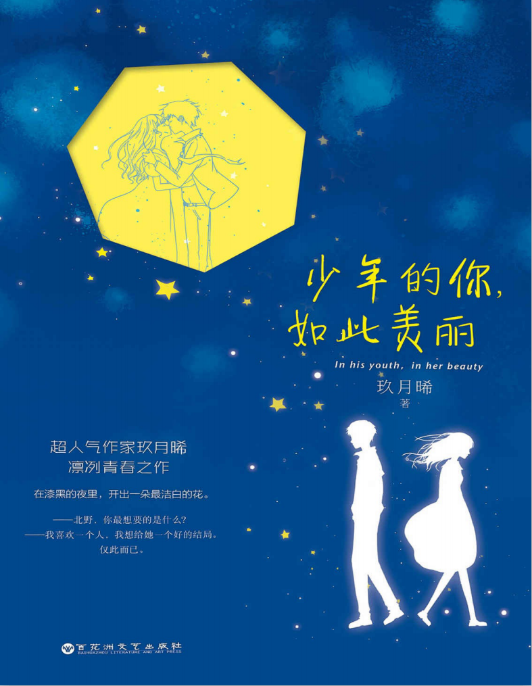

# 《少年的你，如此美丽》

嘲笑和排斥从幼儿园开始，谁说人之初性本善呢，谁说“他们只是孩子”呢，孩子的等级划分、拉帮结派和打压异己，偏偏是最原始最残酷的。

他们不像成年人伪善，所以他们看不起谁，讨厌谁，就光明正大表现出来，光明正大地欺压他，嘲笑他，孤立他，打击他。

不久前，李想说出了她的心里话：“好好学习，加油努力，等考试完了，就能永远离开这里了。”,所谓努力，所谓奋斗，说白了，只是为逃离眼下所在的困境

有经过的路人，匆匆加快脚步离开是非之地，没人敢搭理。勇气从来是件奢侈品。

在长大，老去的……路上，我不要变坏，”她又口吃了，努力挣扎，吐出一句，“不要变成我……少年时最痛……恨的那种人。

> 六月，萋草丛生，陈念望着火车窗外北野家的屋顶急速消失，两行泪如急雨下落。
> 
> 那一天，他们坐在高高的屋顶，她问：
> 
> ——北野，你最想要的是什么？
> 
> ——我喜欢一个人，我想给她一个好的结局。
> 
> 仅此而已。
